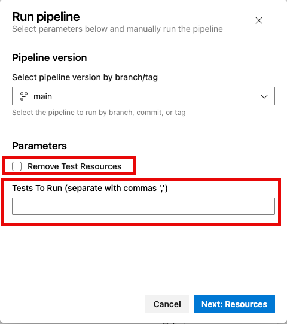
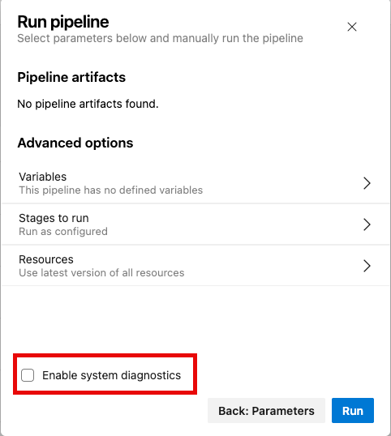
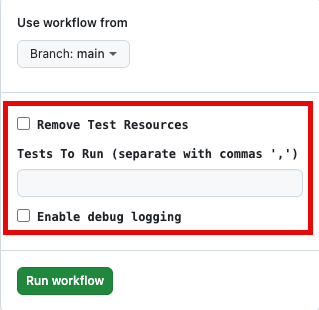
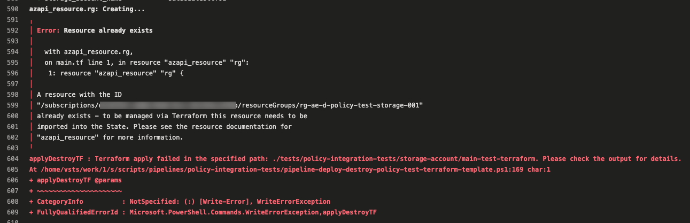

# AzPolicyFactory — Frequently Asked Questions (FAQ)

## Table of Contents

- [AzPolicyFactory — Frequently Asked Questions (FAQ)](#azpolicyfactory--frequently-asked-questions-faq)
  - [Table of Contents](#table-of-contents)
  - [Pipeline Configurations](#pipeline-configurations)
    - [How do I exclude certain Pester tests from being executed in the Azure DevOps pipelines or GitHub Actions?](#how-do-i-exclude-certain-pester-tests-from-being-executed-in-the-azure-devops-pipelines-or-github-actions)
    - [Why do the policy assignment and exemption Bicep templates use custom definition files instead of Bicep parameter files?](#why-do-the-policy-assignment-and-exemption-bicep-templates-use-custom-definition-files-instead-of-bicep-parameter-files)
    - [I'm using self-hosted runners / agents for the pipelines / workflows. What software and tools do I need to install on the runners / agents?](#im-using-self-hosted-runners--agents-for-the-pipelines--workflows-what-software-and-tools-do-i-need-to-install-on-the-runners--agents)
    - [Can I re-use the ADO pipeline templates and GitHub custom actions defined in this repository for other Azure IaC implementation?](#can-i-re-use-the-ado-pipeline-templates-and-github-custom-actions-defined-in-this-repository-for-other-azure-iac-implementation)
    - [Why do the pipelines / workflows use a custom Bicep deployment script instead of the built-in Azure DevOps and GitHub Actions tasks for Bicep deployment?](#why-do-the-pipelines--workflows-use-a-custom-bicep-deployment-script-instead-of-the-built-in-azure-devops-and-github-actions-tasks-for-bicep-deployment)
    - [Does the Bicep / ARM templates size limit impact the deployment of the policy resources in this repository?](#does-the-bicep--arm-templates-size-limit-impact-the-deployment-of-the-policy-resources-in-this-repository)
  - [Azure DevOps Pipelines](#azure-devops-pipelines)
    - [How do I configure the ADO pipelines to use self-hosted agents instead of Microsoft-hosted agents?](#how-do-i-configure-the-ado-pipelines-to-use-self-hosted-agents-instead-of-microsoft-hosted-agents)
    - [Do these pipelines support Azure DevOps servers?](#do-these-pipelines-support-azure-devops-servers)
  - [GitHub Actions](#github-actions)
    - [How do I configure the GitHub Actions workflows to use self-hosted runners instead of GitHub-hosted runners?](#how-do-i-configure-the-github-actions-workflows-to-use-self-hosted-runners-instead-of-github-hosted-runners)
  - [Policy Resources](#policy-resources)
    - [How does the Policy Assignments pipeline / workflow populate the non-compliance messages for each policy assignment?](#how-does-the-policy-assignments-pipeline--workflow-populate-the-non-compliance-messages-for-each-policy-assignment)
    - [Why do we have non-compliance messages defined for each policy assignment? Can't we just use the default message for all policy assignments?](#why-do-we-have-non-compliance-messages-defined-for-each-policy-assignment-cant-we-just-use-the-default-message-for-all-policy-assignments)
    - [Do I need to update the Bicep templates when I add new policy resources to the repository?](#do-i-need-to-update-the-bicep-templates-when-i-add-new-policy-resources-to-the-repository)
  - [Azure Configurations](#azure-configurations)
    - [What is the purpose of dedicated development management group hierarchy in the recommended architecture for Azure Policy IaC implementation?](#what-is-the-purpose-of-dedicated-development-management-group-hierarchy-in-the-recommended-architecture-for-azure-policy-iac-implementation)
  - [Testing](#testing)
    - [What is the purpose of Policy Assignment Environment Consistency tests and why are they important?](#what-is-the-purpose-of-policy-assignment-environment-consistency-tests-and-why-are-they-important)
    - [My Policy Integration Tests failed, how do I troubleshoot the failures?](#my-policy-integration-tests-failed-how-do-i-troubleshoot-the-failures)
    - [What Terraform for Azure providers can I use for the Policy Integration Tests?](#what-terraform-for-azure-providers-can-i-use-for-the-policy-integration-tests)
    - [Why do I need to encrypt the Terraform state file in the Policy Integration Test pipeline / workflow?](#why-do-i-need-to-encrypt-the-terraform-state-file-in-the-policy-integration-test-pipeline--workflow)
    - [In Policy Integration Test pipeline / workflow, do I need to configure a remote backend for Terraform state management?](#in-policy-integration-test-pipeline--workflow-do-i-need-to-configure-a-remote-backend-for-terraform-state-management)
    - [A Policy Integration Test case that uses Terraform failed with an error indicating resource already exists](#a-policy-integration-test-case-that-uses-terraform-failed-with-an-error-indicating-resource-already-exists)
    - [How does the Policy Integration Test pipeline determine which subscriptions to trigger policy compliance scan for and how long does it have to wait after the resource deployments](#how-does-the-policy-integration-test-pipeline-determine-which-subscriptions-to-trigger-policy-compliance-scan-for-and-how-long-does-it-have-to-wait-after-the-resource-deployments)
    - [How do I define the wait time for each policy effect type in the Policy Integration Test pipeline / workflow?](#how-do-i-define-the-wait-time-for-each-policy-effect-type-in-the-policy-integration-test-pipeline--workflow)
    - [In the Policy Integration Test pipeline / workflow, what happens if the required policy assignments are missing or not evaluated](#in-the-policy-integration-test-pipeline--workflow-what-happens-if-the-required-policy-assignments-are-missing-or-not-evaluated)

## Pipeline Configurations

### How do I exclude certain Pester tests from being executed in the Azure DevOps pipelines or GitHub Actions?

<details>
<summary>Click to expand</summary>

You can exclude specific Pester tests by excluding the test tags associated with those tests in the pipeline YAML files.

For the 3 sets of tests included from the `AzPolicyTest` module, use the following commands to get the list of available tags for each test:

1. Firstly, install the `AzPolicyTest` module from the PowerShell Gallery if you haven't already:

```powershell
Install-Module -Name AzPolicyTest -Scope CurrentUser
```

2. To get the list of tags for each test, you can run the following command:

```powershell
#Policy Definition tests
$results = Test-AzPolicyDefinition -Path <path_to_policy_definitions_folder>

#Policy Initiative tests
$results = Test-AzPolicyInitiative -Path <path_to_policy_initiatives_folder>

#List the test names and tags
$results.tests | format-table Name, Tag -AutoSize
```

For other Pester tests that are included in the repository, you can check the test files to identify the tags associated with each test.

Once you have identified the tags for the tests you want to exclude, you can update the pipeline YAML files to exclude those tags from being executed in the pipelines.

The pipeline / workflow parameters for excluded tags for each test type are as follows:

- Policy Definition tests
  - ADO Pipelines
    - Pipeline Names: `Policy-Definition` & `Policy-Initiative`
    - Pipeline Stages: `Policy Definition Tests`
    - Parameter Name: `definitionTestExcludeTags`
  - GitHub Action Workflows
    - Workflow Names: `policy-definitions` & `policy-initiatives`
    - Workflow Jobs: `Policy Definition Tests`
    - Parameter Name: `definition-test-exclude-tags`
- Policy Assignment and Exemption Configuration File Syntax tests
  - ADO Pipelines
    - Pipeline Names: `Policy-Assignment` & `Policy-Exemption`
    - Pipeline Stages: `Test Dev` & `Test Prod`
    - Pipeline Template: `template-job-policy-assignment-exemption-config-syntax-validate.yml`
    - Parameter Name: `excludeTags`
  - GitHub Action Workflows
    - Workflow Names: `policy-assignments` & `policy-exemptions`
    - Workflow Jobs: `Test Dev` & `Test Prod`
    - Custom Action: `validate-policy-assignment-and-exemption-config-syntax`
    - Parameter Name: `exclude-tags`

At the moment, the following Pester tests used in this project do not support excluding tags:

- Bicep Support File tests
- PSRule tests (configured using the PSRule configuration file [ps-rule.yml](../.ps-rule/ps-rule.yml))
- Policy Assignment Environment Consistency tests

</details>

### Why do the policy assignment and exemption Bicep templates use custom definition files instead of Bicep parameter files?

<details>
<summary>Click to expand</summary>

A fundamental design decision we have made is that each policy resource should be self-contained in separate files.

Initially, we implemented the policy assignment and exemption Bicep templates using parameter files for each policy assignment and exemption. To increase deployment velocity, we had to leverage matrix jobs in the pipelines / workflows to deploy each assignment and exemption in parallel.

This approach has some significant drawbacks:

- The maximum concurrent jobs are determined by how many concurrent agent jobs are purchased in your Azure DevOps environment (or how many available self-hosted pipeline agents you have). It can become very expensive to increase the concurrent job limit in Azure DevOps.
- The Policy Assignments and Exemptions ADO pipelines can potentially consume all available agents in your Azure DevOps environment, which can impact other pipelines running at the same time.
- Lengthy deployment times when there are a large number of policy assignments and exemptions to be deployed, even with parallel jobs.

To overcome these challenges, we have designed the policy assignment and exemption Bicep templates to use custom definition files (in JSON format) for each policy assignment and exemption instead of using parameter files.

By using this approach, we can deploy all policy assignments and exemptions in a single job (single Bicep deployment) while still maintaining the self-contained design for each policy resource.

The Bicep templates are designed to create the policy assignments and exemptions concurrently (with up to 15 concurrent resource deployments defined in Bicep), which can significantly reduce the deployment time without the need to increase the concurrent job limit in Azure DevOps.

In summary, using custom definition files for each policy assignment and exemption allows us to achieve faster deployment times and reduce the cost of running the pipelines while still maintaining a clean and organized structure for our policy resources.

</details>

### I'm using self-hosted runners / agents for the pipelines / workflows. What software and tools do I need to install on the runners / agents?

<details>
<summary>Click to expand</summary>

The following software and tools need to be installed on the self-hosted runners / agents to run the pipelines / workflows successfully:

- PowerShell 7.2 or later
- Azure PowerShell Az module (latest version)
- Bicep CLI (latest version)
- Pester PowerShell module (latest version)
- AzPolicyTest PowerShell module (latest version)
- PSRule PowerShell module (latest version)
- PSRule.Rules.Azure PowerShell module (latest version)
- PowerShell-Yaml PowerShell module (latest version, GitHub action runners only)

</details>

### Can I re-use the ADO pipeline templates and GitHub custom actions defined in this repository for other Azure IaC implementation?

<details>
<summary>Click to expand</summary>

Yes. All the ADO templates and GitHub custom actions defined in this repository are designed to be reusable for other Azure IaC implementations. You can easily modify the existing pipeline templates and custom actions to fit the specific requirements of your Azure IaC implementation.

</details>

### Why do the pipelines / workflows use a custom Bicep deployment script instead of the built-in Azure DevOps and GitHub Actions tasks for Bicep deployment?

<details>
<summary>Click to expand</summary>

We moved away from using the built-in Azure DevOps task for ARM / Bicep template deployment because it does not support retrying failed deployments.

We have experienced some random transient failures in the Bicep deployments in our pipelines in customer environments which had nothing to do with the Bicep templates or the Azure resources being deployed. These transient failures can be caused by various factors such as temporary network issues, service availability, or throttling by Azure.

To overcome these challenges and prevent transient issues from causing pipeline failures, we implemented a custom Bicep deployment script that includes a retry mechanism with exponential backoff. This allows the deployment to automatically retry in case of transient failures, which can significantly improve the reliability of the deployments in the pipelines.

By default, the HTTP timeout value is set to 100 seconds in the Az PowerShell module and it is not configurable. This has also caused issues in the past. We then moved away from using the Az PowerShell module for Bicep deployments and developed the custom Bicep deployment script using the ARM REST API directly, which allows us to parameterize a longer timeout value for the deployment operations.

</details>

### Does the Bicep / ARM templates size limit impact the deployment of the policy resources in this repository?

<details>
<summary>Click to expand</summary>

The Bicep / ARM templates have the following size limits:

- The compressed template size itself can’t exceed 4 MB, and each individual resource definition can’t exceed 1 MB after compression.
- 256 parameters
- 256 variables
- 800 resources (including copy count)
- 64 output values
- 24,576 characters in a template expression

Although we have never encountered these limits in customer environments when deploying policy resources using the pipelines and workflows in this repository, it is still possible to hit these limits if you have a large number of policy resources to deploy.

If you have encountered these limits, you can consider the following approaches:

- Split policy resources into batches.
- Duplicate the test and deployment stages / jobs in the pipelines / workflows to deploy each batch separately.

>:memo: The details of the Bicep / ARM template limits can be found in the official Microsoft documentation: [Resolve errors for job size exceeded](https://learn.microsoft.com/azure/azure-resource-manager/troubleshooting/error-job-size-exceeded?tabs=bicep).

</details>

## Azure DevOps Pipelines

### How do I configure the ADO pipelines to use self-hosted agents instead of Microsoft-hosted agents?

<details>
<summary>Click to expand</summary>

All the ADO pipeline templates are designed to work with both Microsoft-hosted agents and self-hosted agents. If you want to use self-hosted agents, you will need to search for the `vmImage` parameters in each pipeline YAML file and replace them with `poolName`, and make sure the value for the `poolName` parameter matches the name of your self-hosted agent pool.

</details>

### Do these pipelines support Azure DevOps servers?

<details>
<summary>Click to expand</summary>

Short answer: Yes. You can run all the ADO pipelines in Azure DevOps Server (on-premises) environment.

However, you will need to make some adjustments to the pipeline YAML files to use self-hosted agents instead.

</details>

## GitHub Actions

### How do I configure the GitHub Actions workflows to use self-hosted runners instead of GitHub-hosted runners?

<details>
<summary>Click to expand</summary>

In each workflow YAML file, you will need to update the `runs-on` property to specify the name of your self-hosted runner. Details of this configuration can be found in the [GitHub documentation](https://docs.github.com/en/actions/reference/workflows-and-actions/workflow-syntax#jobsjob_idruns-on).

</details>

## Policy Resources

### How does the Policy Assignments pipeline / workflow populate the non-compliance messages for each policy assignment?

<details>
<summary>Click to expand</summary>

The non-compliance messages for each policy assignment are defined in the `nonComplianceMessages` property in the policy assignment configuration files. The Policy Assignments pipeline / workflow uses a [PowerShell script](../scripts/pipelines/pipeline-set-policy-non-compliance-messages.ps1) to populate the non-compliance messages for each policy assignment during the build stage / job.

The script does the following:

1. Sets the default message to `You have not met all standards set by '<name of assigned policy or initiative>'. Refer to the policy for requirements.`
2. If a policy initiative is assigned, the script will iterate through all the policies included in the initiative and add a non-compliance message for each policy in the initiative with the format `PolicyID: <policy reference id> Violation in <policy initiative name> Initiative - '<member policy display name>'`

</details>

### Why do we have non-compliance messages defined for each policy assignment? Can't we just use the default message for all policy assignments?

<details>
<summary>Click to expand</summary>

A negative feedback we often receive from end users is that the default non-compliance message for Azure Policy is too generic and does not provide enough information for them to understand why they are non-compliant and what they need to do to become compliant.

To address this issue using the native capability, we can define custom non-compliance message for each member policy for the assigned policy initiatives, and a default message for the policy assignment.

However, this approach is very tedious and error-prone to do manually, especially when there are a large number of policy assignments and initiatives with multiple member policies included in the initiatives.

Therefore we have automated the process of populating the non-compliance messages for each policy assignment in the pipeline / workflow. The messages for the individual member policy definitions in the initiatives include the display name of the member policy. They should provide more clarity to the end users on why they are non-compliant and what they need to do to become compliant.

</details>

### Do I need to update the Bicep templates when I add new policy resources to the repository?

<details>
<summary>Click to expand</summary>

No, you do not need to update the Bicep templates when you add new policy resources to the repository, as long as you follow the existing structure and format for the policy definition, initiative, assignment, and exemption files.

The ADO pipelines and GitHub Actions workflows are designed to automatically pick up all the files from the designated folders for policy definitions, initiatives, assignments, and exemptions. As long as you add new policy resources following the existing structure and format, the pipelines and workflows will be able to deploy them without any modifications to the Bicep templates.

This approach greatly simplifies the process and reduces the Bicep skills required for Azure Policy administrators. The Bicep templates are essentially hidden from the policy administrators.

</details>

## Azure Configurations

### What is the purpose of dedicated development management group hierarchy in the recommended architecture for Azure Policy IaC implementation?

<details>
<summary>Click to expand</summary>

We recommend having a dedicated development management group hierarchy for the Azure Policy IaC implementation. This is required so policy resources do not impact existing resources before release to production.

Microsoft's documentation [Manage application development environments in Azure landing zones](https://learn.microsoft.com/azure/cloud-adoption-framework/ready/landing-zone/design-area/management-application-environments) recommends having production and non-production subscriptions in the same management group hierarchy. Do not confuse this with the recommendation for Azure Policy IaC implementation.

From Policy management perspective, the development management group hierarchy is dedicated for policy development and testing. Only the policy administrators and developers should have access to this management group hierarchy.

We treat the management group hierarchy that contains production and non-production workload and platform subscriptions as the production management group hierarchy.

The policy development management group hierarchy should mirror the production management group hierarchy in terms of structure and scope of policy assignments. This allows us to test the policy changes in an environment that closely resembles production before deploying the changes to production.

However, we do not need to recreate all the production subscriptions in the policy development management group hierarchy. This will be explained in detail in the Policy Integration Test documentation which is coming soon.

</details>

## Testing

### What is the purpose of Policy Assignment Environment Consistency tests and why are they important?

<details>
<summary>Click to expand</summary>

When deploying Policy definitions and initiatives, the same artifacts are deployed to both development and production management group hierarchies. Unlike policy definitions and initiatives, the policy assignments have different configurations for each environment.

There is no way to test the exact same policy assignment configuration in the development environment before deploying to production because the resources referenced in the policy assignment for the development environment are different from those in production and some assignments may have different settings between environments.

The Policy Assignment Environment Consistency tests PR validation pipeline was the result of an actual failed policy deployment in production environments in a customer's environment due to the inconsistency between the policy assignment configurations for development and production environments.

The tests are designed to validate the consistency of the policy assignment configurations between development and production environments to prevent such issues from happening again in the future.

Refer to the [Policy Assignment Environment Consistency Tests documentation](./assignment-environment-consistency-tests.md) for more details.

</details>

### My Policy Integration Tests failed, how do I troubleshoot the failures?

<details>
<summary>Click to expand</summary>

Troubleshooting the policy integration test pipeline failure can be hard because by default the pipeline will remove the deployed resources at the end of the test run, which makes it hard to investigate the failed resources in Azure.

To make it easier to troubleshoot the failures, we have added few parameters in the Pipeline / workflow to allow you to keep the deployed resources in Azure after the test run for investigation and have verbose output in the pipeline logs to provide more context on the test execution and failure.

You can manually execute the Policy Integration Test pipeline / workflow with the following parameters:

**Azure DevOps Pipeline Parameters**





**GitHub Action Workflow Inputs**



- **Remove Test Resources:** Untick this parameter to keep the deployed resources in Azure after the test run for investigation. By default, this parameter is set to `true` which means the deployed resources will be removed at the end of the test run.
- **Tests To Run (separate with commas ','):** Specify the test cases you want to run. By default, all test cases will be executed. You can specify the test cases by their test names defined in the local configuration file for each test case (e.g. `storage-account`, `key-vault`).
- **Enable system diagnostics (ADO) / Enable debug logging (GitHub Actions):** Enable this option to have more verbose output in the pipeline logs for troubleshooting. By default, this option is set to `false` which means the pipeline logs will not be verbose.

>:memo: Remember to clean up the deployed resources manually in Azure after you have finished the investigation if you choose to keep the resources for troubleshooting.

</details>

### What Terraform for Azure providers can I use for the Policy Integration Tests?

<details>
<summary>Click to expand</summary>

Currently there are 2 Terraform providers for Azure:

- [AzureRM Provider](https://registry.terraform.io/providers/hashicorp/azurerm/latest/docs) - The most widely used Terraform provider for Azure, which supports a wide range of Azure resources and is maintained by HashiCorp in collaboration with Microsoft.
- [AzAPI Provider](https://registry.terraform.io/providers/Azure/azapi/latest/docs) - A newer Terraform provider for Azure, which provides support for Azure resources that are not yet supported in the AzureRM provider by directly calling the Azure REST APIs.

Natively in Azure Resource Manager deployment API, the [`what-if` API](https://learn.microsoft.com/rest/api/resources/deployments/what-if?view=rest-resources-2025-04-01&tabs=HTTP) can be used to validate a deployment against assigned policies with `deny` effect. However, since `terraform plan` command does not use the ARM deployment APIs, it does not have the capability for Azure Policy evaluation.

We are leveraging the [Policy Restriction API](https://learn.microsoft.com/rest/api/policyinsights/policy-restrictions?view=rest-policyinsights-2024-10-01) to evaluate the resource configuration for Terraform. This API supports both `deny` and `audit` effect policies.

To use the Policy Restriction API, we have to pass the resource configuration payload EXACTLY as what the resource provider defines it (like Bicep templates). The resource configuration payload in AzureRM is obscured and does not align with the definitions from each Azure Resource Provider. It is not possible to reconstruct the resource configuration payload in AzureRM to match the format required by the Policy Restriction API.

On the other hand, the AzAPI provider uses the **EXACT** same payload as the resource provider, hence we can use the `terraform plan` output from AzAPI provider to call the Policy Restriction API for policy evaluation.

In summary, if you evaluating `Append`, `Modify`, `Audit` or `AuditIfNotExists` effects by evaluating the deployed resource configuration or the policy compliance state of these resources in Azure, you can use either AzureRM or AzAPI provider for the Policy Integration Tests. However, if you want to evaluate `Deny` or `Audit` effect policies by validating the resource configuration without deploying the resources, you **MUST** use the AzAPI provider for the Policy Integration Tests.

**TL,DR**:

- In the `main-test-terraform` project, you can use either AzureRM or AzAPI providers
- In the `main-bad-terraform` and `main-good-terraform` projects, you **MUST** only use the AzAPI provider

</details>

### Why do I need to encrypt the Terraform state file in the Policy Integration Test pipeline / workflow?

<details>
<summary>Click to expand</summary>

If you are using the cloud version of Azure DevOps or GitHub Actions, the logs and artifacts generated in the pipeline / workflow runs are stored in a centralized storage which is encrypted at rest.

However, since the storage used by the platform are typically owned and operated by the platform provider (Microsoft and GitHub in this case), to add an extra layer of security for the Terraform state files, we have implemented an additional encryption mechanism in the pipeline / workflow using AES encryption.

By adding the extra layer of encryption, we can ensure that even if someone gains unauthorized access to the storage where the pipeline / workflow logs and artifacts are stored, they will not be able to access the sensitive information in the Terraform state files without the AES encryption key and initialization vector (IV) which are stored securely in the pipeline / workflow variables as secrets.

Although this is not a mandatory requirement, it is recommended because Terraform state file may contain sensitive information if the Terraform code is not aligned with best practices.

</details>

### In Policy Integration Test pipeline / workflow, do I need to configure a remote backend for Terraform state management?

<details>
<summary>Click to expand</summary>

No. The terraform deployments are short-lived and will be destroyed at the end of each test run. The lifecycle of the terraform state files are limited to the duration of the test run.

To make the terraform state file available across multiple stages / jobs in the pipeline / workflow, we have configured the pipeline to upload the state file as a pipeline artifact after the terraform deployment stage / job, and download the state file artifact in the subsequent stages / jobs that need to access the state file.

</details>

### A Policy Integration Test case that uses Terraform failed with an error indicating resource already exists

<details>
<summary>Click to expand</summary>

A resource deployment step may fail with the error similar to the following:



This error typically occurs when the test resources were deployed by Terraform in a previous run and were not destroyed at the end of the test run due to a failure in the destroy step or because the "Remove Test Resources" parameter was set to false for troubleshooting purposes.

To resolve this issue, you must manually delete all the resources defined in the Terraform project and re-run the failed pipeline / workflow.

</details>

### How does the Policy Integration Test pipeline determine which subscriptions to trigger policy compliance scan for and how long does it have to wait after the resource deployments

<details>
<summary>Click to expand</summary>

The `Get Test Configuration` job in the Policy Integration Test pipeline / workflow runs a PowerShell script to scan each in scope test cases and identify the following:

- Which test configurations from the `AzResourceTest` module are used by each test case
- Which subscriptions are targeted for each test case based on the test configuration

It also retrieves the required wait time for each policy effect type from the [Policy Integration Test global configuration file](./policy-integration-tests-global-config.md).

From here, it determines which subscriptions will need to trigger the policy compliance scan (based on the use of the `New-ARTPolicyStateTestConfig` command), and what is the maximum wait time for the pipeline based on the configuration from the global configuration file.

The Pipeline then uses the output of this job to trigger (or skip triggering) the policy compliance scan for each required subscription in the subsequent job after the resource deployment, and to determine how long it should wait before checking the policy compliance state for the test resources.
</details>

### How do I define the wait time for each policy effect type in the Policy Integration Test pipeline / workflow?

<details>
<summary>Click to expand</summary>

The following properties in the [Policy Integration Test global configuration file](./policy-integration-tests-global-config.md) are used to define the wait time for each policy effect type:

- Policy Compliance state validation (for all effect types)
  - `waitTimeForPolicyComplianceStateAfterDeployment`: Set to 15. This is the time required for the policy compliance scan to finish. Based on our experience, 15 minutes is typically sufficient in this case.
- Append and Modify effect policies
  - `waitTimeForAppendModifyPoliciesAfterDeployment`: Set to 1. As long as the policy assignment has completed the initial evaluation, there is no need to wait. We have configured the pipeline to wait for 1 minute for this use case just to be safe.
- Resource Existence validation for policies with `DeployIfNotExists` effect
  - `waitTimeForDeployIfNotExistsPoliciesAfterDeployment`: Set to 5. This is the time required for `DeployIfNotExists` policy deployments to trigger and complete, including Azure Resource Graph indexing if querying resource existence via ARG. Increase this value if you experience failures due to long-running deployments or missing `evaluationDelay` in the policy definition.

</details>

### In the Policy Integration Test pipeline / workflow, what happens if the required policy assignments are missing or not evaluated

<details>
<summary>Click to expand</summary>

In the [local configuration file](./policy-integration-tests-local-config.md) of each test case, the `policyAssignmentIds` property defines the required policy assignments for the test case.

If any of the required policy assignments are missing, the test case will fail.

If any of the required policy assignments are not evaluated yet (after initial deployment or after a change is made to the policy assignment), the Policy Integration Test pipeline / workflow will wait for up to 20 minutes for the policy assignments to complete the initial evaluation cycle.
</details>
