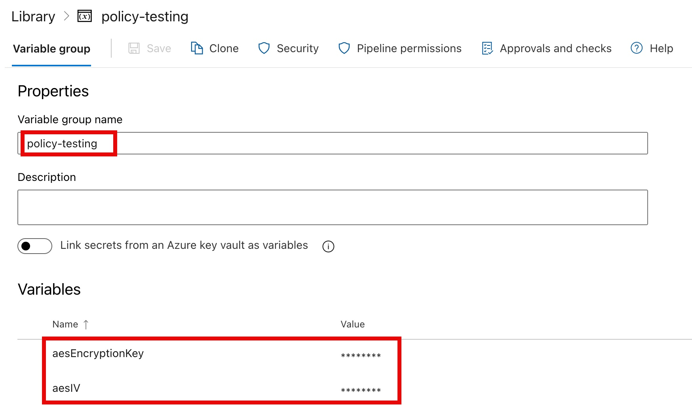

# Setup Guide for Azure DevOps Pipelines

This document provides a step-by-step guide to set up the Azure DevOps (ADO) pipelines for deploying Azure Policy resources using the AzPolicyFactory solution.

Before you begin, make sure you have the necessary pre-requisites in place as outlined in the [Pre-requisites](../pre-requisites.md) document.

## Step 1: Create Service Connections in your Azure DevOps Project

To allow the Azure DevOps pipelines to authenticate and deploy resources to your Azure environment, you need to create service connections in your Azure DevOps project for each environment (development and production).

The identity used by the service connection needs to have the `Owner` role assigned at the top Enterprise Scale Landing Zone (ESLZ) management group.

The service connection should be configured using the `Management Group` scope level.

You should configure separate service connections for development and production environments using different identities.

## Step 2: Configure Pipeline Variables

Update the following variable values in the [settings.yml](../../settings.yml) file to match your environment and service connection names:

| Variable Name | Description | Example Value |
| :------------ | :---------- | :------------ |
| `defaultAgentPoolName` | The name of the default Microsoft hosted agent pool to use for the pipelines. | `ubuntu-latest` |
| `ado-prodPolicyServiceConnection` | The name of the ADO service connection for the production environment (created in the previous step). | `mg-prod-root-owner` |
| `ado-devPolicyServiceConnection` | The name of the ADO service connection for the development environment (created in the previous step). | `mg-dev-root-owner` |
| `default-region` | The default Azure region to use for Azure resource deployment. | `australiaeast` |
| `prodManagementGroup` | The name of the top-level production management group where the policies will be deployed. | `CONTOSO` |
| `devManagementGroup` | The name of the top-level development management group where the policies will be deployed. | `CONTOSO-DEV` |
| `prodEnv` | The name of the production environment. | `prod` |
| `devEnv` | The name of the development environment. | `dev` |
| `whatIfValidationMaxRetrys` | The maximum number of retries for the What-If validation step in the pipeline. (3-10) | `4` |

## Step 3: Add Policy Resources to the repository

Follow the instructions in the [Add Policy Resources](../add-policy-resources.md) document to add the following resources to the repository:

- Custom Azure Policy definitions in the `./policyDefinitions` folder
- Custom Azure Policy initiatives in the `./policyInitiatives` folder
- Policy assignment configuration files in the `./policyAssignments` folder
- Policy exemption configuration files in the `./policyExemptions` folder

## Step 4: Create Azure DevOps Pipelines for Policy Resources

Create the following pipelines in your Azure DevOps project using the YAML files provided in the `.azuredevops/pipelines/policies` folder:

| Pipeline Name | Description | YAML File |
| :------------ | :---------- | :-------- |
| Policy-Definitions | deploys custom Azure Policy definitions | [`azure-pipelines-policy-definitions.yml`](../../.azuredevops/pipelines/policies/azure-pipelines-policy-definitions.yml) |
| Policy-Initiatives | deploys custom Azure Policy initiatives | [`azure-pipelines-policy-initiatives.yml`](../../.azuredevops/pipelines/policies/azure-pipelines-policy-initiatives.yml) |
| Policy-Assignments | deploys Azure Policy assignments | [`azure-pipelines-policy-assignments.yml`](../../.azuredevops/pipelines/policies/azure-pipelines-policy-assignments.yml) |
| Policy-Exemptions | deploys Azure Policy exemptions | [`azure-pipelines-policy-exemptions.yml`](../../.azuredevops/pipelines/policies/azure-pipelines-policy-exemptions.yml) |

>:exclamation: IMPORTANT: You **MUST** create the ADO pipelines with the **EXACT** name as shown in the table above. The pipeline YAML files reference each other and rely on the pipeline names to trigger the correct downstream pipelines. If you choose to use different pipeline names, you will need to update the downstream pipeline YAML files to reference the new pipeline names.

## Step 5: Configure Branch Protection Policies (Optional)

To ensure that changes to the pipeline YAML files and policy resources are reviewed and approved before being merged into the main branch, it is recommended to configure branch protection policies in your Azure DevOps repository as per your organization's governance requirements.

We recommend at least the following configurations are in place for the main branch:

- Require a minimum number of reviewers for pull requests (e.g., 2 or more)
- Limit merge type to only allow `Squash merge` to maintain a clean commit history

## Step 6: Create PR Validation Pipelines for the main branch (Optional but Recommended)

To ensure that any changes to the policy resources are validated before being merged into the main branch, it is recommended to set up the following pull request (PR) validation pipelines in the branch protection policy for the `main` branch.

### Policy Assignment Configuration Validation

This pipeline validates and compares the values in each production policy assignment configuration file against the corresponding development environment configuration file to ensure consistency between the two environments.

| Pipeline Name | Description | YAML File |
| :------------ | :---------- | :-------- |
| Validate-Policy-Assignment-Environment-Consistency | validates and compares policy assignment configuration files between environments | [`azure-pipelines-pr-policy-assignment-env-consistency-tests.yml`](../../.azuredevops/pipelines/validation/azure-pipelines-pr-policy-assignment-env-consistency-tests.yml) |

This is to ensure any value deviations between the two environments are intentional and reviewed before being merged into the main branch.

>:exclamation: **IMPORTANT**: Follow the instructions in the [Policy Assignment Environment Consistency Tests](../assignment-environment-consistency-tests.md) to understand and customize the tests performed by this workflow.

The pipeline will fail if any differences are detected between the production and development configuration files.

This pipeline should be triggered automatically when a pull request is created that includes changes to any of the policy assignment configuration files or the related pipeline YAML files.

- `Build pipeline`: [`azure-pipelines-pr-policy-assignment-env-consistency-tests.yml`](../../.azuredevops/pipelines/validation/azure-pipelines-pr-policy-assignment-env-consistency-tests.yml)
- Path filter: `/policyAssignments/*; /.azuredevops/pipelines/validation/azure-pipelines-pr-policy-assignment-config-tests.yml; /.azuredevops/templates/template-stage-policy-assignment-config-tests.yml; /tests/policy/assignment/environment-consistency/*`
- trigger: `Automatic`
- Policy requirement: `Required`
- `Build expiration`: `Immediately when main is updated`
- Display name: `Policy Assignment Configuration Validation`

### PR-Validation (Code Scan)

This pipeline performs a code scan using GitHub Super-Linter to validate all the files in the repository with a wide range of different linters and rulesets to ensure code quality and consistency.

| Pipeline Name | Description | YAML File |
| :------------ | :---------- | :-------- |
| PR-Code-Scan | performs a code scan using GitHub Super-Linter to validate all the files in the repository | [`azure-pipelines-pr-validation.yml`](../../.azuredevops/pipelines/validation/azure-pipelines-pr-validation.yml) |

Once the pipeline is created, configure the branch protection policy for the `main` branch to include this pipeline as a required check before merging.

- `Build pipeline`: [`azure-pipelines-pr-validation.yml`](../../.azuredevops/pipelines/validation/azure-pipelines-pr-validation.yml)
- Path filter: leave it blank
- trigger: `Automatic`
- Policy requirement: `Required`
- `Build expiration`: `Immediately when main is updated`
- Display name: `PR Validation`

>:memo: NOTE: You can customize the linters and rulesets used by GitHub Super-Linter by modifying the configuration file of each linter in the `.github/linters` folder. For details on how to customize the GitHub Super-Linter, please refer to the [official project site](https://github.com/super-linter/super-linter).

### Policy Integration Tests Pipeline

When triggered from a PR, this pipeline use `git diff` to retrieve the list of changes in the PR, analyze the changes to identify required test cases from policy integration test, and then run the identified test cases to validate the functionality and effectiveness of the policies being changed in the PR.

| Pipeline Name | Description | YAML File |
| :------------ | :---------- | :-------- |
| Validate-Policy-Integration-Tests | Policy Integration Tests | [`azure-pipelines-pr-policy-int-tests.yml`](../../.azuredevops/pipelines/validation/azure-pipelines-pr-policy-int-tests.yml) |

Once the pipeline is created, configure the branch protection policy for the `main` branch to include this pipeline as a required check before merging.

- `Build pipeline`: [`azure-pipelines-pr-policy-int-tests.yml`](../../.azuredevops/pipelines/validation/azure-pipelines-pr-policy-int-tests.yml)
- Path filter: leave it blank
- trigger: `Automatic`
- Policy requirement: `Required`
- `Build expiration`: `Immediately when main is updated`
- Display name: `Policy Integration Tests`

>:memo: NOTE: There is no need to specify the path filter for this pipeline because the pipeline has built-in logic to analyze and determine which test cases are required. If no test cases are identified based on the changes in the PR, the pipeline will be automatically skipped.

Next, create an AES encryption key and store it in a variable group in the Azure DevOps project. This AES encryption key will be used to encrypt the Terraform state file generated by the test cases if any test cases are configured to deploy resources using Terraform.

To create an AES encryption key, you can use the [newAesKey.ps1](../../scripts/support/policy-integration-test/newAesKey.ps1) PowerShell script provided in the `scripts` folder of this repository. This script will generate random AES key that can be used for AES encryption.:

```PowerShell
.\newAesKey.ps1
```

It will output a random AES key and its IV:

```text
Key                                          IV                       KeySize Created
---                                          --                       ------- -------
xvO6cbYyQao8ZbD+mtLSYmb0gzN+kYllxF83nOSDNgk= zoGQQ+iRPZ5+LnJ/uU/egA==     256 2026-04-05T23:45:28.8350380Z
```

Create a variable group called `**policy-testing**` in your Azure DevOps project and add the generated AES key and IV as secret variables in the variable group:

- **aesEncryptionKey**: the generated AES key value (i.e. `xvO6cbYyQao8ZbD+mtLSYmb0gzN+kYllxF83nOSDNgk=`)
- **aesIV**: the generated AES IV value (i.e. `zoGQQ+iRPZ5+LnJ/uU/egA==`)



Make sure the Policy Inetegration Tests pipeline has access to this variable group.

Lastly, it's best that you store the AES encryption key and IV in another secure location in case you need to examine the encrypted Terraform state files for troubleshooting or debugging purposes in the future.

## Step 7: Grant Policy Pipelines Permissions to Access Service Connections

After creating the pipelines and service connections, you need to grant the pipelines permission to access the service connections in order for them to deploy resources to your Azure environment.

For both the development and production service connections, grant all the policy pipelines (Policy-Definitions, Policy-Initiatives, Policy-Assignments, and Policy-Exemptions) to have the permission to use the service connections.

## Step 8: Test run the pipelines

Test run the pipelines from your feature branch to ensure they are working as expected before merging into the main branch. You can trigger the pipelines manually from the Azure DevOps portal.

The production environment will be automatically ignored during the test runs as long as they are not triggered from the main branch.

## Step 9: Merge changes to the main branch

After successful tests, you can merge the changes to the main branch by raising a Pull Request (PR) and having it reviewed and approved by the required number of reviewers as per your branch protection policy.

After the PR is approved and merged, manually trigger the `Policy-Definitions` pipeline from the Azure DevOps portal to start the deployment process for the production environment. This will then trigger the downstream pipelines to deploy the policy initiatives, assignments, and exemptions to the production environment.

